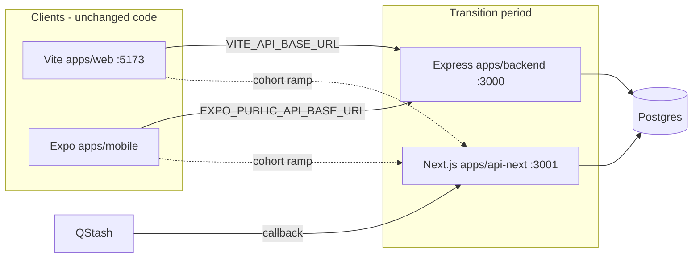

# API Next Migration Plan (Option 2)

Date: 2026-06-26 (reviewed & updated with clarifications/gaps 2026-06-26)

Related: [Next.js Backend + QStash Migration Notes](./2026-06-23-nextjs-backend-qstash-migration-notes.md)

## Decision

**Chosen scope:** Add a new Next.js backend app (`apps/api-next`) alongside the existing Vite web app and Express backend.

**Not in scope (for now):** Replacing `apps/web` with Next.js. The Vite SPA stays unchanged; only `VITE_API_BASE_URL` / `VITE_AUTH_API_BASE_URL` change at cutover.

**Goal:** Move HTTP API + QStash callback + maintenance cron to Next.js on the Node runtime, retire the Express API and pg-boss worker, keep Postgres and the existing service/repository layer.

## Post-Review Clarifications & Gaps (2026-06-26)

This plan was reviewed against the source notes and current codebase (`apps/backend/src`, clients, tests). It is faithful to the original requirements. The following items were identified as important clarifications or gaps to address during implementation. These are **not** changes to scope but call-outs for sequencing, adapters, and known friction points.

### High-Priority Adapter Gaps (front-load)
- **Auth cookie transport (`writeAuthTransport` / `clearAuthTransport`)**: Located in `apps/backend/src/auth/http.ts`. These use Express `res.cookie()`, `req.secure`, `request.header(...)`, and `shouldUseCookieTransport`. The plan statement "Set auth transport cookies via existing `writeAuthTransport`" will not work verbatim.  
  **Action**: Create a thin framework-agnostic adapter (or dual implementations) before or during Phase 1. Web clients rely on `credentials: 'include'` + refresh cookies. Do **not** defer to Phase 7.
- **DB pool error handling**: `apps/backend/src/db/pool.ts` performs a hard `process.exit(-1)` on idle client errors. The "softened" strategy mentioned in the DB Pool table must be implemented (or a non-fatal listener + degraded flag) for stability under Next dev/hot-reload and long-running deploys.
- **Raw body for QStash**: Confirmed — only the internal scheduled-task route must consume the body as text first. All other routes can use normal JSON parsing.

### Environment Variable Naming
Use the canonical names from `apps/backend/src/config.ts` and `reminders/runtime.ts`:
- `REMINDER_SCHEDULER_CALLBACK_BASE_URL` (not the shorthand `QSTASH_CALLBACK_BASE_URL`).
- Keep separate auth vs. data base URLs (`VITE_AUTH_API_BASE_URL` / `EXPO_PUBLIC_AUTH_API_URL`).

Update all examples and `.env*` files accordingly.

### Local Development & QStash Callbacks
Real QStash callbacks cannot reach `localhost:3001`. Document (in this plan or a runbook):
- Use a tunnel (ngrok / cloudflared / localtunnel) for end-to-end QStash testing in staging-like flows.
- Use the `disabled` scheduler provider for pure local dev of create/update paths.
- Keep the existing mock verifier tests (`internal-routes.test.ts`) for unit-level work.

### ESM + Cross-App Imports
- Backend uses `"type": "module"`, `"module": "NodeNext"`, and explicit `.js` extensions in imports.
- `@backend/*` path alias (proposed in api-next `tsconfig.json`) works for TypeScript dev but requires care at runtime in `next start`.
- Consider early extraction of domain code to `packages/backend-core` if alias friction appears in Phase 0/1, or use relative imports + build step for the first few phases.

### Test Harness for api-next
Adapting `apps/backend/src/tests/support/http-test-server.ts` for Next is non-trivial:
- Spinning `next dev` on port 3001 for parity tests is slow and port-conflict prone.
- Preferred: Use Next's internal request handler (`next()` + `handle`) in-process for contract tests, or a lightweight `createServer` wrapper.
- Many "expressApi" web tests only stub `fetch` + env; true parity lives in `apps/backend/src/tests/parity/*`.

Create `apps/api-next/tests/support/next-test-server.ts` (or equivalent) early.

### Other Notes
- In-memory rate limiters (auth + AI) are acceptable while running as a single long-lived process. Document for future horizontal scaling.
- Health shapes must match exactly (`/health/live` and `/health/ready` responses from `health.ts` + `health/readiness.ts`).
- A stale parallel file exists: `apps/backend/src/reminders/qstash-scheduler-provider.ts`. Confirm it has no callers before deleting (per original notes).
- Service composition in `startApi.ts` (reminder runtime + notesService injection) must be replicated faithfully in `src/server/compose-services.ts`.

## Architecture



During `shadow`, only parity tests hit Next. During `pilot` / `ramp`, env URLs shift traffic. At `full`, the Express API is retired and the worker is already gone.

## Effort Summary

| Scope | Incremental effort | Total to production |
|-------|-------------------|---------------------|
| Shared backend migration (both options) | — | ~25–38 person-days |
| Option 2 delta (separate Next backend) | +3–5 days | ~28–38 person-days (~6–8 weeks) |
| Option 1 delta (replace apps/web) | +13–23 days | ~38–55 person-days (~7–11 weeks) |

Option 2 is recommended because it de-risks backend hosting first, matches existing web cutover cohorts (`shadow → pilot → ramp → full`), and leaves zero frontend regression risk during migration.

## Target Directory Layout

```text
apps/api-next/
  app/
    api/
      auth/
        register/route.ts
        login/route.ts
        refresh/route.ts
        logout/route.ts
        upgrade-session/route.ts
      notes/
        route.ts                          # GET /
        sync/route.ts                     # POST /sync
        trash/empty/route.ts              # DELETE /trash/empty
        [noteId]/
          route.ts                        # DELETE /:noteId
          restore/route.ts                # POST /:noteId/restore
          permanent/route.ts              # DELETE /:noteId/permanent
      reminders/
        route.ts                          # GET, POST /
        [reminderId]/
          route.ts                        # GET, PATCH, DELETE
          ack/route.ts
          snooze/route.ts
      subscriptions/                        # mirror notes trash/restore pattern
      expenses/                             # largest surface (~14 handlers)
      device-tokens/
        route.ts                            # POST /
        [deviceId]/route.ts                 # DELETE
      merge/
        preflight/route.ts
        apply/route.ts
      ai/
        parse-voice/route.ts
        clarify/route.ts
      sample/route.ts
    health/
      live/route.ts
      ready/route.ts
    internal/
      reminders/
        scheduled-task/route.ts             # QStash callback (requires raw body)
    cron/
      reminders-repair/route.ts             # maintenance / repair-job
  src/
    server/
      compose-services.ts                   # from apps/backend/src/runtime/startApi.ts
      dependency-gate.ts                    # from apps/backend/src/health.ts gate
    handlers/
      auth/                                 # framework-agnostic handler functions
      notes/
      reminders/
      subscriptions/
      expenses/
      device-tokens/
      merge/
      ai/
    http/
      with-api-handler.ts                   # replaces withErrorBoundary + response writing
      errors.ts                             # AppError → NextResponse
      validate.ts                           # zod parse helpers
      cors.ts                               # from createApiServer CORS
      raw-body.ts                           # QStash signature verification
      auth/
        require-access.ts                   # from access-middleware.ts
        rate-limit.ts                       # from auth/routes.ts limiter
    db/
      pool.ts                               # adapted pool or re-export during transition
  next.config.ts                            # runtime = 'nodejs' on all API routes
  package.json
  tsconfig.json
  .env.example
```

All API route handlers must use `export const runtime = 'nodejs'` (not Edge).

## Import Strategy

### Phase 1–6 (during migration)

`apps/api-next` imports domain code from `apps/backend/src` via TypeScript path alias:

```json
{
  "compilerOptions": {
    "paths": {
      "@backend/*": ["../backend/src/*"]
    }
  }
}
```

Route handlers import services directly:

```typescript
// app/api/notes/sync/route.ts
import { createNotesService } from '@backend/notes/service';
import { withApiHandler } from '@/http/with-api-handler';
```

**Caveat (from review):** Backend source uses ESM + explicit `.js` import extensions. Path alias resolution works in TypeScript but test the full `next dev` + typecheck flow early in Phase 0. See Post-Review Clarifications for ESM notes.

### Phase 7 (Express retirement)

Move domain modules (`auth/`, `notes/`, `reminders/`, etc.) into `packages/backend-core`. Delete Express-only files (`runtime/createApiServer.ts`, `*/routes.ts`, `worker/`). Keep operational CLI scripts in `apps/backend` (`migrate.ts`, `migration-tools/`, `backfillReminderSchedules.ts`).

## HTTP Adapter Pattern

Each Next route is a thin shell. Shared logic lives in handler functions extracted from Express `routes.ts`:

```text
Express:  router.post('/login', loginRateLimit, validate, handler)
          ↓
Handler:  src/handlers/auth/login.ts     — (ctx: RequestContext) => result | AppError
          ↓
Next:     app/api/auth/login/route.ts    — export const POST = withApiHandler(loginHandler, ...)
```

`withApiHandler` responsibilities:

- Parse `NextRequest` → `RequestContext` (body, params, query, headers, IP, cookies)
- Run the framework-agnostic handler
- Map `AppError` → JSON + status (same shape as `apps/backend/src/middleware/error-middleware.ts`)
- Set auth transport cookies (via adapter for the Express-specific `writeAuthTransport`/`clearAuthTransport` in `@backend/auth/http` — see Post-Review Clarifications section)

### QStash raw body requirement

The internal callback route must read the raw body before JSON parsing. Express does this today via `express.json({ verify })` in `createApiServer.ts` (only for that route). In Next, use `await request.text()` (then `JSON.parse` for the handler body) **only** in `app/internal/reminders/scheduled-task/route.ts`. All other routes may use `request.json()` normally. See also the raw-body note in Post-Review Clarifications.

## DB Pool Decision (Phase 0)

| Hosting target | Pool strategy | Effort |
|----------------|---------------|--------|
| Long-running Node (Railway, Fly, Docker, `next start`) | Keep `pg.Pool` from `@backend/db/pool` with softened `process.exit` on idle errors | Low |
| Vercel serverless | `@vercel/postgres` or Neon serverless driver | Medium–high |

**Recommendation:** Deploy `api-next` as a long-running Node process. This keeps `pool.ts` mostly unchanged and matches the Node-runtime guidance in the QStash migration notes.

**Implementation note (from review):** `apps/backend/src/db/pool.ts` currently does `process.exit(-1)` on pool errors. Phase 0 must either soften this (e.g. set degraded flag and let readiness return 503) or wrap the listener. Hard exit is unacceptable under Next.js dev server restarts. See Post-Review Clarifications.

## Phased PR Plan (~7 weeks)

### Phase 0 — Scaffold (2–3 days) — PR #1

| Task | Detail |
|------|--------|
| Create `apps/api-next` | `create-next-app` with App Router, TypeScript |
| Workspace wiring | Package name: `@ai-note-keeper/api-next` |
| Root scripts | Add `dev:api-next`; Next listens on **3001**, Express stays **3000** |
| `next.config.ts` | `serverExternalPackages: ['pg', '@node-rs/argon2']` |
| Env | Copy from `apps/backend/.env.example`; add `API_NEXT_PORT=3001`, `REMINDER_SCHEDULER_CALLBACK_BASE_URL` (plus QStash keys when testing callbacks) |
| Health routes | `/health/live`, `/health/ready` |
| HTTP foundation | `withApiHandler`, `AppError` mapper, CORS middleware (parity with `createApiServer.ts`) |
| Auth transport adapter | Thin wrapper or dual implementation so `writeAuthTransport` / cookie logic works from Next routes (see clarifications) |
| DB pool hardening | Soften `process.exit` behavior or integrate with dependency degraded flag (see DB Pool Decision) |
| Service composition | Port `startApi.ts` wiring → `src/server/compose-services.ts` (include reminder runtime + notesService special injection) |

**Exit criteria:** `curl localhost:3001/health/ready` returns the **exact same shape** as Express (including `checks`); `curl localhost:3001/health/live` works; lint and typecheck pass. No hard `process.exit` on pool errors during dev.

---

### Phase 1 — Auth + dependency gate (3–4 days) — PR #2

| Express | Next.js |
|---------|---------|
| `POST /api/auth/register` | `app/api/auth/register/route.ts` |
| `POST /api/auth/login` | `app/api/auth/login/route.ts` |
| `POST /api/auth/refresh` | `app/api/auth/refresh/route.ts` |
| `POST /api/auth/logout` | `app/api/auth/logout/route.ts` |
| `POST /api/auth/upgrade-session` | `app/api/auth/upgrade-session/route.ts` |
| `GET /api/sample` | `app/api/sample/route.ts` |
| Dependency gate on `/api/*` | Check in `withApiHandler` or route wrapper |

Port tests from `apps/backend/src/tests/auth/routes.test.ts`.

**Exit criteria:** Auth route tests pass against api-next; web login works with `VITE_AUTH_API_BASE_URL=http://localhost:3001` **including cookie transport** (refresh cookies set and round-tripped via `credentials: 'include'`). Dependency gate active on `/api/*`.

---

### Phase 2 — Notes + subscriptions (4–5 days) — PR #3–4

**Notes (6 endpoints):**

| Method | Path |
|--------|------|
| GET | `/api/notes` |
| POST | `/api/notes/sync` |
| DELETE | `/api/notes/trash/empty` |
| POST | `/api/notes/:noteId/restore` |
| DELETE | `/api/notes/:noteId/permanent` |
| DELETE | `/api/notes/:noteId` |

**Subscriptions (8 endpoints):** same trash/restore pattern plus `GET /trash`.

Port `requireAccessUserOrWebGuest()` from `apps/backend/src/auth/access-middleware.ts`.

**Exit criteria:** `apps/web/tests/notes.expressApi.test.ts` and `subscriptions.expressApi.test.ts` pass against Next base URL; `phase4.http.contract` tests pass.

---

### Phase 3 — QStash backbone (3–4 days) — PR #5

| Route | Notes |
|-------|-------|
| `POST /internal/reminders/scheduled-task` | Port `apps/backend/src/reminders/internal-routes.ts` |
| Reminders CRUD (7 endpoints) | Create/update must schedule via QStash |
| `app/cron/reminders-repair/route.ts` | Invoke `apps/backend/src/reminders/repair-job.ts` |

Set `REMINDER_SCHEDULER_CALLBACK_BASE_URL` (and signing keys) to the api-next public host. QStash cannot callback to localhost without a tunnel — see Post-Review Clarifications for local dev guidance.

**Exit criteria:**

- Create reminder → QStash fires → callback executes → next occurrence scheduled
- `internal-routes.test.ts` and `scheduled-task-executor.test.ts` pass
- Idempotent replay test passes

---

### Phase 4 — Remaining API surface (4–5 days) — PR #6–7

| Module | Endpoints | Complexity |
|--------|-----------|------------|
| `device-tokens` | 2 | Low |
| `merge` | 2 | Medium |
| `ai` | 2 | Medium (rate limiter) |
| `expenses` | 14 | High (nested resources) |

**Exit criteria:** `phase5.http.contract.test.ts` passes entirely against Next.

---

### Phase 5 — Worker replacements (4–6 days) — PR #8

| Old worker job | New home |
|----------------|----------|
| Per-reminder dispatch | QStash (Phase 3) |
| `repair-job.ts` | `cron/reminders-repair` (Phase 3) |
| `dispatch-due-subscription-reminders.ts` | QStash scheduled scan or cron calling `jobs/subscriptions/scanner.ts` |
| Push retry | QStash delayed callback or cron + `push-delivery-service.ts` |

**Exit criteria:** `phase5.worker.contract.test.ts` scenarios covered without pg-boss; worker can stop in dev without functional regression.

---

### Phase 6 — Cutover (3–5 days) — PR #9

Use existing web cohort machinery in `apps/web/src/config/cutover.ts`:

| Cohort | Action |
|--------|--------|
| `shadow` | Parity tests only; prod traffic → Express |
| `pilot` | Staging web → `VITE_API_BASE_URL` → api-next |
| `ramp` | Gradual prod traffic shift |
| `full` | All clients → api-next; Express API stopped |

**Environment changes at pilot+:**

```env
# apps/web
VITE_API_BASE_URL=https://api-next.example.com
VITE_AUTH_API_BASE_URL=https://api-next.example.com

# apps/mobile
EXPO_PUBLIC_API_BASE_URL=https://api-next.example.com
EXPO_PUBLIC_AUTH_API_URL=https://api-next.example.com

# QStash / scheduler
REMINDER_SCHEDULER_CALLBACK_BASE_URL=https://api-next.example.com
# (plus QSTASH_TOKEN, QSTASH_CURRENT_SIGNING_KEY, QSTASH_NEXT_SIGNING_KEY)
```

**CORS dev origins:** `http://localhost:5173`, `http://127.0.0.1:5173` (from `createApiServer.ts` defaults).

**Exit criteria:** Rollback drill — flip env back to Express in under 15 minutes; SLO gates in cutover config pass.

---

### Phase 7 — Cleanup (2–3 days) — PR #10

| Action | Target |
|--------|--------|
| Delete | `apps/backend/src/worker/` |
| Delete | `apps/backend/src/runtime/createApiServer.ts` |
| Delete | `apps/backend/src/*/routes.ts` |
| Extract (optional) | Domain → `packages/backend-core` |
| Keep | `migrate.ts`, `migration-tools/`, `backfillReminderSchedules.ts` as CLI scripts |

## Complete Route Mapping

| # | Express | Next.js App Router |
|---|---------|-------------------|
| 1 | `GET /health/live` | `app/health/live/route.ts` |
| 2 | `GET /health/ready` | `app/health/ready/route.ts` |
| 3 | `POST /api/auth/register` | `app/api/auth/register/route.ts` |
| 4 | `POST /api/auth/login` | `app/api/auth/login/route.ts` |
| 5 | `POST /api/auth/refresh` | `app/api/auth/refresh/route.ts` |
| 6 | `POST /api/auth/logout` | `app/api/auth/logout/route.ts` |
| 7 | `POST /api/auth/upgrade-session` | `app/api/auth/upgrade-session/route.ts` |
| 8 | `GET /api/notes` | `app/api/notes/route.ts` |
| 9 | `POST /api/notes/sync` | `app/api/notes/sync/route.ts` |
| 10 | `DELETE /api/notes/trash/empty` | `app/api/notes/trash/empty/route.ts` |
| 11 | `POST /api/notes/:noteId/restore` | `app/api/notes/[noteId]/restore/route.ts` |
| 12 | `DELETE /api/notes/:noteId/permanent` | `app/api/notes/[noteId]/permanent/route.ts` |
| 13 | `DELETE /api/notes/:noteId` | `app/api/notes/[noteId]/route.ts` |
| 14 | `GET /api/reminders` | `app/api/reminders/route.ts` |
| 15 | `POST /api/reminders` | `app/api/reminders/route.ts` |
| 16 | `GET /api/reminders/:reminderId` | `app/api/reminders/[reminderId]/route.ts` |
| 17 | `PATCH /api/reminders/:reminderId` | `app/api/reminders/[reminderId]/route.ts` |
| 18 | `DELETE /api/reminders/:reminderId` | `app/api/reminders/[reminderId]/route.ts` |
| 19 | `POST /api/reminders/:reminderId/ack` | `app/api/reminders/[reminderId]/ack/route.ts` |
| 20 | `POST /api/reminders/:reminderId/snooze` | `app/api/reminders/[reminderId]/snooze/route.ts` |
| 21 | `POST /internal/reminders/scheduled-task` | `app/internal/reminders/scheduled-task/route.ts` |
| 22 | `GET /api/subscriptions` | `app/api/subscriptions/route.ts` |
| 23 | `GET /api/subscriptions/trash` | `app/api/subscriptions/trash/route.ts` |
| 24 | `POST /api/subscriptions` | `app/api/subscriptions/route.ts` |
| 25 | `PATCH /api/subscriptions/:subscriptionId` | `app/api/subscriptions/[subscriptionId]/route.ts` |
| 26 | `DELETE /api/subscriptions/trash/empty` | `app/api/subscriptions/trash/empty/route.ts` |
| 27 | `DELETE /api/subscriptions/:subscriptionId` | `app/api/subscriptions/[subscriptionId]/route.ts` |
| 28 | `POST /api/subscriptions/:subscriptionId/restore` | `app/api/subscriptions/[subscriptionId]/restore/route.ts` |
| 29 | `DELETE /api/subscriptions/:subscriptionId/permanent` | `app/api/subscriptions/[subscriptionId]/permanent/route.ts` |
| 30–43 | `/api/expenses/*` (14 routes) | `app/api/expenses/**` |
| 44 | `POST /api/device-tokens` | `app/api/device-tokens/route.ts` |
| 45 | `DELETE /api/device-tokens/:deviceId` | `app/api/device-tokens/[deviceId]/route.ts` |
| 46 | `POST /api/merge/preflight` | `app/api/merge/preflight/route.ts` |
| 47 | `POST /api/merge/apply` | `app/api/merge/apply/route.ts` |
| 48 | `POST /api/ai/parse-voice` | `app/api/ai/parse-voice/route.ts` |
| 49 | `POST /api/ai/clarify` | `app/api/ai/clarify/route.ts` |
| 50 | `GET /api/sample` | `app/api/sample/route.ts` |
| 51 | *(new)* maintenance | `app/cron/reminders-repair/route.ts` |

## Test Strategy

| Layer | Approach |
|-------|----------|
| Unit (services, repos) | Stay in `apps/backend/src/tests` — unchanged |
| Route contract | New `apps/api-next/tests/` harness; adapt (or replace) `http-test-server.ts` pattern for Next (see clarifications — in-process handler preferred over spawning `next dev`) |
| Parity | Point `phase4/phase5.http.contract.test.ts` at Next via `API_TEST_BASE_URL=http://127.0.0.1:3001` |
| Web integration | Existing Vitest tests (e.g. `notes.expressApi.test.ts`) primarily stub `VITE_API_BASE_URL`; run full contract tests + any real-server variants against 3001 in CI |
| QStash | Keep mock verifier from `internal-routes.test.ts` |

**CI matrix during transition:**

```text
backend-express  → existing test suite
api-next         → route + parity tests (API_TEST_BASE_URL=http://127.0.0.1:3001)
```

When the api-next instance under test needs scheduler callbacks, supply `REMINDER_SCHEDULER_*` envs to that process.

## Root Script Changes

**PR #1 (Phase 0)** — add to root `package.json` only:

```json
{
  "dev:api-next": "npm --workspace apps/api-next run dev",
  "test:api-next": "npm --workspace apps/api-next run test"
}
```

**Phase 1+** — add parity runner when auth routes and api-next contract tests are ready:

```json
{
  "test:parity:next": "cross-env API_TEST_BASE_URL=http://127.0.0.1:3001 npm --workspace apps/backend run test -- --test-path-pattern=parity"
}
```

Use `cross-env` (not bare POSIX `VAR=value` prefix) so the script works on Windows npm.

Update `dev` to include api-next alongside express, web, and mobile as needed.

## What Stays Untouched

| Artifact | Why |
|----------|-----|
| `apps/web` (all UI) | Option 2 — only env URL changes at cutover |
| `apps/mobile` | Env URL changes only |
| `packages/shared` | No changes |
| `apps/backend` migration CLI | Operational scripts, not HTTP |
| Postgres schema / migrations | Unchanged |

## Risk Checkpoints (Go/No-Go Gates)

See also the detailed adapter gaps in the "Post-Review Clarifications & Gaps" section above. Gates have been updated to cover the highest-risk items identified in review (auth cookies, pool behavior, health shape).

| After phase | Gate |
|-------------|------|
| Phase 0 | DB connects; health/ready **exact shape match**; pool no longer hard-exits on error in dev; basic CORS |
| Phase 1 | Auth cookies (including `writeAuthTransport` path) + CORS work from Vite dev server (`http://localhost:5173`); dependency gate active |
| Phase 2 | Notes optimistic sync parity with Express |
| Phase 3 | End-to-end QStash reminder fires in staging |
| Phase 4 | Full HTTP contract suite green |
| Phase 5 | 24h staging run with worker stopped |
| Phase 6 | Rollback drill completed |

## First PR Scope

PR #1 (Phase 0) touches only:

1. `apps/api-next/` — new app (scaffold + health + HTTP foundation + auth transport stub + pool error handling)
2. Root `package.json` — workspace entry + `dev:api-next` and `test:api-next` scripts (not `test:parity:next` — deferred to Phase 1+)
3. `apps/api-next/.env.example`
4. No changes to `apps/backend` yet (import via path alias only)

**Note:** Auth transport adapter and pool softening may be implemented inside `api-next/src` initially (adapters calling into `@backend/...`), with any shared refactoring happening in later phases or as a small preparatory change if alias friction appears.

## Files That Move Mostly Unchanged

See [2026-06-23-nextjs-backend-qstash-migration-notes.md](./2026-06-23-nextjs-backend-qstash-migration-notes.md) for the full list of domain, repository, and integration files that are reused with thin adapters.

## Files Deleted After Migration

See the same migration notes for worker runtime, legacy reminder dispatch, and subscription scanning files to delete once replacement paths are verified in Phase 5.