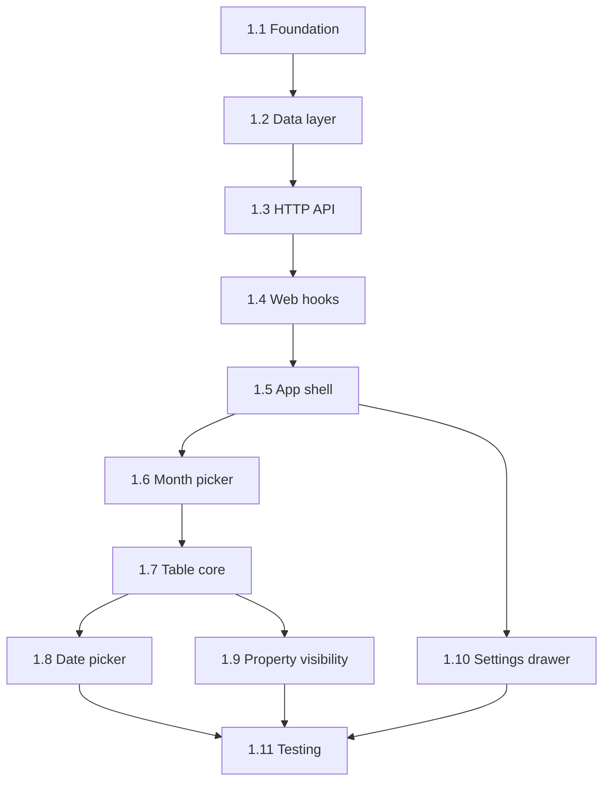

# Expense Notes — Implementation Plan

**Source:** [`expense-notes-design.md`](./expense-notes-design.md)  
**Scope:** Web first → polish → mobile  
**Last updated:** 2026-06-06

This plan breaks the design into phased, task-level work items. No implementation detail or code — only *what* to build, in *what order*, and how to verify each chunk.

---

## Overview

| Phase | Goal | Outcome |
|-------|------|---------|
| **Phase 1** | MVP | Expenses tab live on web: one Notion-style table per month, VND amounts, SUM, date picker, property visibility, settings drawer with seed rows |
| **Phase 2** | Polish | Trash, search, richer date picker, custom columns, row reorder, guest merge |
| **Phase 3** | Mobile | Expo app reads/writes same API with simplified table UI |

**Suggested Phase 1 duration:** 3–5 dev sessions (foundation → API → UI shell → table → settings → tests).

---

## Phase 1 — MVP (Web)

### 1.1 Foundation & shared contracts

| ID | Task | Deliverable | Verify |
|----|------|-------------|--------|
| 1.1.1 | Add shared expense types | `packages/shared/types/expense.ts` exported from shared package | Types compile; mirror design §6.2 fields |
| 1.1.2 | Define default schema constant | Single source for 5 default columns (Expense, #, Amount, Date, Comment) | Matches design §5.6 JSON |
| 1.1.3 | Add web expense utils (pure functions) | `expenseUtils.ts`: `formatAmountVnd`, `formatExpenseDate`, `computeSum`, `formatPeriodLabel`, `getCurrentYearMonth` | Unit tests pass |
| 1.1.4 | Add DB migration `00010_expense_notes.sql` | Tables: `expense_user_settings`, `expense_periods`, `expense_rows` | Migration runs clean on empty + existing DB |

**Exit:** Types + migration + utils tested; no API yet.

---

### 1.2 Backend — data layer

| ID | Task | Deliverable | Verify |
|----|------|-------------|--------|
| 1.2.1 | Create `expenses/contracts.ts` | Zod schemas for settings, period, row, schema columns; request/response shapes | Invalid payloads rejected in tests |
| 1.2.2 | Create `expenses/repository.ts` | CRUD for settings, periods, rows; list periods by user; find by `(userId, year, month)` | Repository tests against test DB |
| 1.2.3 | Bootstrap default settings | On first `GET /settings`, insert default schema + empty `seed_rows` | New user gets defaults |
| 1.2.4 | Period creation with seed rows | `createPeriod`: copy `default_schema` → period `schema`; insert `seed_rows` as rows with static amounts | New period has N seed rows in order |
| 1.2.5 | Sum computation (server) | Recompute `sum` on period read from row `amount` cells | Matches `computeSum` util |
| 1.2.6 | Row default values on create | `POST row` merges column `defaultValue` from period schema into `cells` | New row has schema defaults |

**Exit:** Service layer handles full period lifecycle without HTTP.

---

### 1.3 Backend — HTTP API

| ID | Task | Deliverable | Verify |
|----|------|-------------|--------|
| 1.3.1 | Create `expenses/service.ts` | Orchestrates repository + validation rules (§11) | Service unit tests |
| 1.3.2 | Create `expenses/routes.ts` | All routes from design §8 | Route integration tests |
| 1.3.3 | Register routes in `createApiServer.ts` | `app.use('/api/expenses', …)` | Server starts; `/api/expenses/settings` responds |
| 1.3.4 | Auth on all routes | `requireAccessUserOrWebGuest()`; scope by `userId` | Guest + auth user isolation tests |
| 1.3.5 | `GET /periods/current` | Get or create current calendar month (local semantics documented) | First call creates period; second returns same |
| 1.3.6 | `GET /periods/by-month` | Resolve or 404; used before lazy-create from picker | Future month returns 404 until created |
| 1.3.7 | `POST /periods` | Create period for `{ year, month }` with seed rows | Idempotent guard on duplicate month |
| 1.3.8 | `PATCH /periods/:id/schema` | Update visibility, order, column names for active month | Schema persists; rows unchanged |
| 1.3.9 | Row endpoints | `POST`, `PATCH` for cells/position | Cell updates persist; sum updates |

**Exit:** Full API contract exercisable via tests or manual HTTP client.

---

### 1.4 Web — API client & hooks

| ID | Task | Deliverable | Verify |
|----|------|-------------|--------|
| 1.4.1 | Create `services/expenseTypes.ts` | Web-local types / mappers if needed | Maps API JSON → shared types |
| 1.4.2 | Create `services/expenses.ts` | API client functions for all §8 endpoints | Mocked fetch tests |
| 1.4.3 | `useExpenseDefaults()` | Load + save settings (schema + seed rows) | Drawer can read/write |
| 1.4.4 | `useExpensePeriods()` | List period summaries for dropdown | Returns sorted desc by year/month |
| 1.4.5 | `useExpensePeriod()` | Load period + rows + sum; refetch on month change | Switching month reloads data |
| 1.4.6 | `useCreateExpenseRow()` | `+ New page` mutation | Appends row at bottom |
| 1.4.7 | `useUpdateExpenseRow()` | Debounced PATCH (300ms) per row | Rapid typing coalesces to one request |
| 1.4.8 | `useUpdatePeriodSchema()` | PATCH schema after property visibility | Column hide/reorder reflects in table |
| 1.4.9 | `localStorage` last period | Key `expense:lastPeriod`; restore on tab open; first visit = current month | Refresh restores last month |

**Exit:** Hooks work against real or mocked API; no UI yet.

---

### 1.5 Web — app shell & navigation

| ID | Task | Deliverable | Verify |
|----|------|-------------|--------|
| 1.5.1 | Extend `ActiveTab` type | Add `'expenses'` | Typecheck passes |
| 1.5.2 | Add Expenses tab button | Third tab in `App.tsx` nav | Tab switches visible content |
| 1.5.3 | Create `ExpensesPage.tsx` | Page shell: month picker slot, settings button, table area | Tab renders without error |
| 1.5.4 | Wire tab-specific nav actions | Hide Notes/Subs actions when Expenses active; show expenses controls | No stray Notes buttons on Expenses tab |
| 1.5.5 | Save status in nav (optional) | Reuse Notes save-status pattern for expenses | Shows saving/saved/error on cell edit |

**Exit:** User can open Expenses tab; page is empty shell.

---

### 1.6 Web — month picker

| ID | Task | Deliverable | Verify |
|----|------|-------------|--------|
| 1.6.1 | `ExpenseMonthPicker.tsx` | Dropdown: existing periods + navigate to future months | Lists persisted months |
| 1.6.2 | Future month entries | Generate next N months (e.g. 12 ahead) not yet created | User can pick e.g. "July 2026" before data exists |
| 1.6.3 | Lazy-create on select | Selecting uncreatd month → `POST /periods` → load result | Table appears with seed rows |
| 1.6.4 | Default to current month | On first tab visit, load current month via `GET /periods/current` | Opens June 2026 when today is June 2026 |
| 1.6.5 | Period label formatting | `June 2026` via `formatPeriodLabel` | Consistent with design |

**Exit:** User can switch months and open future months for planning.

---

### 1.7 Web — table core (design 1)

| ID | Task | Deliverable | Verify |
|----|------|-------------|--------|
| 1.7.1 | `ExpenseTable.tsx` | Grid container: header + body + footer | Renders rows from period |
| 1.7.2 | `ExpenseTableHeader.tsx` | Column headers with type icons (Aa, #, ₫, 📅, ≡); `…` opens property visibility | Matches mock layout |
| 1.7.3 | `ExpenseTableRow.tsx` | Row with document icon + visible cells per schema | Hidden columns not rendered |
| 1.7.4 | `#` column | Display-only 1-based index from row `position` | Not sent to API on edit |
| 1.7.5 | `ExpenseTableFooter.tsx` | `+ New page` button + `SUM` under Amount | SUM updates live on edit |
| 1.7.6 | `ExpenseAmountCell.tsx` | VND display + number input; negatives allowed | `16.500 ₫`, `-76 ₫` |
| 1.7.7 | Text cells | Inline edit Expense + Comment | Debounced save |
| 1.7.8 | Empty state | No rows beyond seeds: still show `+ New page` | Usable zero-state |
| 1.7.9 | Table CSS | Dark/light theme; grid lines; hover row | Visually aligned with mocks + app theme |

**Exit:** Full table CRUD via UI for text, amount; read-only #; SUM works.

---

### 1.8 Web — date picker (design 2)

| ID | Task | Deliverable | Verify |
|----|------|-------------|--------|
| 1.8.1 | `ExpenseDatePicker.tsx` | Popover on Date cell click | Anchored to cell |
| 1.8.2 | Calendar grid | Month nav, prev/next, Today shortcut | Can pick a day |
| 1.8.3 | Selected date display | Full date format: `June 4, 2026` | Matches mock |
| 1.8.4 | Clear action | Removes date from row (`null`) | Cell empty after clear |
| 1.8.5 | Store format | ISO `YYYY-MM-DD` in `cells.date` | Consistent serialization |

**Deferred within Phase 1:** End date, include time, remind (Phase 2).

**Exit:** Date column fully editable with picker.

---

### 1.9 Web — property visibility (design 3)

| ID | Task | Deliverable | Verify |
|----|------|-------------|--------|
| 1.9.1 | `ExpensePropertyVisibility.tsx` | Modal: title, search, property list | Opens from header `…` |
| 1.9.2 | Eye toggle per column | Show/hide; Expense column cannot be hidden | Hide/show reflects immediately |
| 1.9.3 | Hide all | Hides all except Expense | One-click hide |
| 1.9.4 | Drag reorder | Updates `position` in schema | Column order changes in table |
| 1.9.5 | Search filter | Filters list in modal | Typing narrows properties |
| 1.9.6 | Persist to period | `PATCH /periods/:id/schema` on save/change | Reload preserves layout |
| 1.9.7 | "Apply to future months" | Checkbox writes schema to `PUT /settings` | New months inherit column layout |

**Exit:** Column visibility and order work for current and future months.

---

### 1.10 Web — settings drawer

| ID | Task | Deliverable | Verify |
|----|------|-------------|--------|
| 1.10.1 | `ExpenseDefaultsDrawer.tsx` | Gear button opens drawer | Accessible from Expenses page |
| 1.10.2 | Column defaults editor | Rename columns; set per-column `defaultValue` for new rows | Saved via `PUT /settings` |
| 1.10.3 | Seed rows editor | Add/remove/reorder seed rows: Expense, Amount, Comment | List persists in settings |
| 1.10.4 | Seed row static amounts | Amount from template only (no prev-month auto-fill) | "prev month" uses typed value |
| 1.10.5 | Apply scope copy | UI explains: affects **newly opened months only** | Clear user expectation |
| 1.10.6 | Default bootstrap | First open shows sensible default seed rows (optional: "Initial budgets", "prev month" examples) | New users see editable template |

**Exit:** User configures defaults; next new month gets schema + seed rows.

---

### 1.11 Phase 1 — testing & sign-off

| ID | Task | Deliverable | Verify |
|----|------|-------------|--------|
| 1.11.1 | `expenseUtils.test.ts` | Sum, VND format, date format, period label | `npm test` green |
| 1.11.2 | Backend `service.test.ts` | Period bootstrap, seed rows, sum, validation | `npm test` green |
| 1.11.3 | Backend `routes.test.ts` | Guest + auth flows, CRUD, isolation | `npm test` green |
| 1.11.4 | Web `expenses.test.ts` | API mappers, hooks behavior (mocked) | `npm test` green |
| 1.11.5 | Lint + typecheck | `npm run lint` + web/backend typecheck | No errors |
| 1.11.6 | Manual UAT checklist | Documented happy path below | Human verification |

**Phase 1 UAT checklist:**

1. Open app → Expenses tab → current month loads.
2. Edit amount → SUM updates → refresh → data persists.
3. `+ New page` → new row with defaults.
4. Date picker → select + clear.
5. Property visibility → hide Comment → table updates.
6. Settings → add seed row → open new future month → seed rows appear with static amounts.
7. Guest mode works; signed-in user has separate data.

**Phase 1 complete when:** All UAT items pass; tests green; no regressions on Notes/Subscriptions tabs.

---

## Phase 2 — Polish (Web)

### 2.1 Row delete & trash

| ID | Task | Deliverable | Verify |
|----|------|-------------|--------|
| 2.1.1 | Soft-delete row API | `DELETE /rows/:id` sets `deleted_at` | Row excluded from table + sum |
| 2.1.2 | Trash list endpoint | `GET /periods/:id/trash` or global trash | Deleted rows listed |
| 2.1.3 | Restore row | `POST /rows/:id/restore` | Row reappears |
| 2.1.4 | Trash UI in nav | Trash button on Expenses tab (mirror Notes) | Toggle trash view |
| 2.1.5 | Row delete affordance | Row menu or delete action in table | Delete → moves to trash |

---

### 2.2 Search within month

| ID | Task | Deliverable | Verify |
|----|------|-------------|--------|
| 2.2.1 | Wire search input for Expenses tab | Reuse nav search when Expenses active | Search box visible |
| 2.2.2 | Client-side filter | Filter rows by Expense + Comment text | Non-matching rows hidden |
| 2.2.3 | SUM in search mode | Sum only visible rows OR all rows (decide & document) | Consistent behavior |

---

### 2.3 Date picker enhancements

| ID | Task | Deliverable | Verify |
|----|------|-------------|--------|
| 2.3.1 | Date format option | User-selectable display format | Format persists |
| 2.3.2 | End date toggle | Date range support (if needed) | Optional range stored |
| 2.3.3 | Include time toggle | Time on date cells | ISO datetime storage |
| 2.3.4 | Remind option | Stub or integrate with reminders system | Document integration point |

---

### 2.4 Custom columns

| ID | Task | Deliverable | Verify |
|----|------|-------------|--------|
| 2.4.1 | `+` column header action | Add column flow | New column in schema |
| 2.4.2 | Column type picker | text / number / date | Renders correct cell editor |
| 2.4.3 | Backfill existing rows | New column gets `defaultValue` on all rows | No undefined cells |
| 2.4.4 | Delete custom column | Remove from schema + strip from cells | Data cleaned |

---

### 2.5 Row reorder

| ID | Task | Deliverable | Verify |
|----|------|-------------|--------|
| 2.5.1 | Drag handle on rows | Reorder within table | Order persists via PATCH |
| 2.5.2 | `#` column updates | Auto-increment reflects new order | Display matches position |

---

### 2.6 Guest → account merge

| ID | Task | Deliverable | Verify |
|----|------|-------------|--------|
| 2.6.1 | Include expenses in merge audit | Count periods, rows for guest | Merge summary shows expenses |
| 2.6.2 | Merge service migration | Copy guest expense data to registered user | No duplicate months after merge |
| 2.6.3 | Conflict policy | Document: guest wins / merge / skip on month collision | Tested |

---

### 2.7 Phase 2 — sign-off

| ID | Task | Deliverable | Verify |
|----|------|-------------|--------|
| 2.7.1 | Tests for new endpoints | Trash, restore, merge | `npm test` green |
| 2.7.2 | Manual UAT | Trash, search, reorder, custom column | Checklist pass |

**Phase 2 complete when:** Trash + search + reorder shipped; merge works; tests green.

---

## Phase 3 — Mobile (Expo)

### 3.1 Shared API integration

| ID | Task | Deliverable | Verify |
|----|------|-------------|--------|
| 3.1.1 | Mobile expense types | Import from `packages/shared/types/expense` | Compiles in mobile |
| 3.1.2 | Mobile API client | Same `/api/expenses` endpoints | Authenticated requests work |
| 3.1.3 | Expense service module | `apps/mobile/src/services/expenses.ts` | Period load/save |

---

### 3.2 Mobile navigation & screen

| ID | Task | Deliverable | Verify |
|----|------|-------------|--------|
| 3.2.1 | Expenses tab / screen | New tab beside Notes (match app nav pattern) | Screen reachable |
| 3.2.2 | Month picker (mobile) | Native picker or bottom sheet | Current + future months |
| 3.2.3 | Defaults screen | Simplified seed rows + column names editor | Settings persist |

---

### 3.3 Mobile table UI (simplified)

| ID | Task | Deliverable | Verify |
|----|------|-------------|--------|
| 3.3.1 | Period summary header | Month label + SUM | SUM correct |
| 3.3.2 | Row list | Flat list: Expense, Amount (VND), Date | Scrollable |
| 3.3.3 | Row editor sheet | Tap row → edit all cells | Saves to API |
| 3.3.4 | Add row FAB / button | Creates row with defaults | Appends to list |
| 3.3.5 | Date picker (mobile) | Platform date picker | Date saves correctly |

**Deferred on mobile v1:** Property visibility drag-reorder, custom columns, trash (can follow Phase 2 web parity).

---

### 3.4 Mobile — sign-off

| ID | Task | Deliverable | Verify |
|----|------|-------------|--------|
| 3.4.1 | Mobile tests | Service + util tests | `npm test` green |
| 3.4.2 | Manual device UAT | Load, edit, add row, switch month | Checklist pass |

**Phase 3 complete when:** Mobile reads/writes same backend; core month workflow works.

---

## Dependency graph (Phase 1)

**Parallelizable after 1.7:** Date picker (1.8), property visibility (1.9), and settings drawer (1.10) can proceed in parallel.

---

## Task count summary

| Phase | Task groups | Approx. tasks |
|-------|-------------|---------------|
| Phase 1 | 11 groups | 52 |
| Phase 2 | 7 groups | 22 |
| Phase 3 | 4 groups | 14 |
| **Total** | **22 groups** | **~88** |

---

## References

- Design: [`expense-notes-design.md`](./expense-notes-design.md)
- Tab shell: `apps/web/src/App.tsx`
- API reference impl: `apps/backend/src/subscriptions/`
- Migrations: `apps/backend/src/db/migrations/`